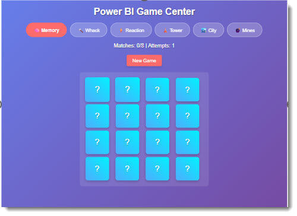

# Game Arcade Six Pack

Six mini-games packed into a single Power BI custom visual: Memory Match, Whack-A-Mole, Reaction Time, Tower Defense, City Builder, and Minesweeper.



## What It Does

A dropdown in the toolbar lets you switch between six games. Each game runs on a canvas inside the visual and has its own controls, scoring, and state. Pick one, play it, switch to another -- they each manage their own lifecycle independently.

## The Games

| Game           | Description                                                          |
| -------------- | -------------------------------------------------------------------- |
| Memory Match   | Flip cards to find matching pairs. Tracks number of moves and time.  |
| Whack-A-Mole   | Moles appear at random -- click them before they disappear.          |
| Reaction Time  | A speed test. Wait for the signal, then click as fast as you can.    |
| Tower Defense  | Place towers along a path to stop enemy waves. Earn currency per kill to build more towers. |
| City Builder   | Manage resources and place buildings to grow a city.                  |
| Minesweeper    | Classic mine-sweeping with left-click to reveal and right-click to flag. |

## Data Roles

| Field    | Type     | Description                       |
| -------- | -------- | --------------------------------- |
| Category | Grouping | Category values for data binding  |
| Measure  | Measure  | Numeric values for data binding   |

The games run independently of bound data. Data roles are available for future integration.

## Features

- Modular game registry -- each game implements a standard interface (init, start, stop, destroy, resize)
- Toolbar with game selector dropdown
- Canvas-based rendering for all games
- Game state persistence within a session
- Responsive canvas sizing when the visual is resized

## How to Run

```
cd gameArcadeSixPack
npm install
pbiviz start
```

Open Power BI and add the Developer Visual to a report page. Use the dropdown at the top of the visual to select a game.
