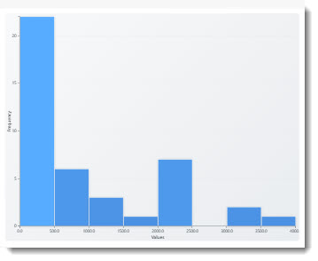

# Histogram

A D3-based histogram that bins numeric values into configurable buckets and displays frequency distribution with gradient colouring.



## What It Does

Drop a numeric field onto the visual and it groups the values into bins, drawing a bar for each bin showing how many values fall within that range. The number of bins is calculated automatically using the square-root rule, or you can configure up to 40 bins manually.

## Data Roles

| Field  | Type     | Description                          |
| ------ | -------- | ------------------------------------ |
| Values | Grouping | Numeric values to bin and count      |

## Features

- Automatic bin calculation (square-root of data count) with manual override up to 40 bins
- Gradient colouring -- bars shade from a base colour, with taller bars rendered in a deeper hue
- Grid lines on the Y axis for readability
- Axis labels with automatic tick formatting
- Tooltips on hover showing bin range and count
- Responsive layout that adapts to the visual container size
- Smooth transitions when data updates

## Formatting Options

| Property        | Description                            |
| --------------- | -------------------------------------- |
| Default Colour  | Base colour for the gradient fill      |
| Font Size       | Axis label size                        |
| Show All Points | Toggle full data point display         |

## How to Run

```
cd histogram
npm install
pbiviz start
```

Open Power BI and add the Developer Visual to a report page. Drop a numeric measure or column onto the Values field.
