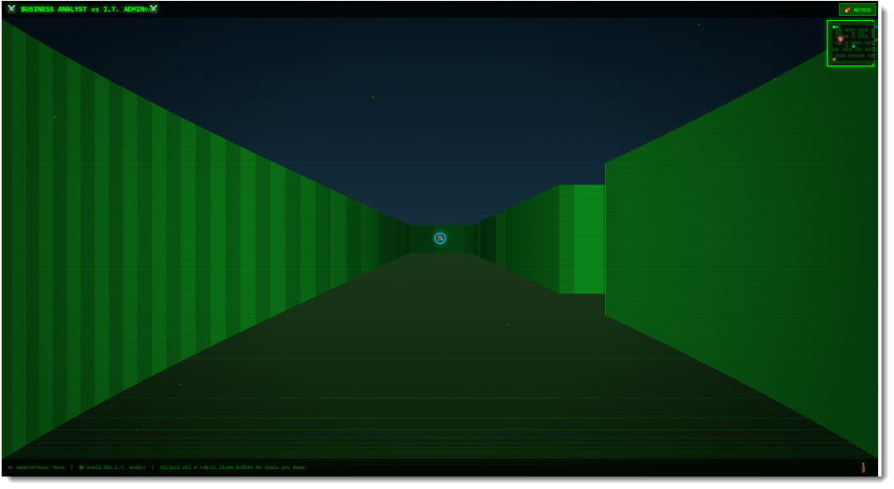

# Matrix and Maze

Navigate the maze of office politics to find the four Power BI treasures before I.T. Admin catches you and shuts you down.



## What It Does

The visual has two modes:

- **Matrix Mode** -- a data rain animation, similar to The Matrix. Green characters cascade down the screen with data values revealed behind them. It looks good on a dashboard and nobody will suspect there is a game hiding behind it.
- **Dungeon Mode** -- a first-person maze game. You navigate corridors from a pseudo-3D perspective, collecting four Power BI treasures while avoiding the I.T. Admin who patrols the maze and will end your session if he catches you.

Click the toggle button in the top-right corner to switch between modes.

## Controls (Dungeon Mode)

| Key          | Action       |
| ------------ | ------------ |
| W / Up       | Move forward |
| S / Down     | Move back    |
| A / Left     | Turn left    |
| D / Right    | Turn right   |

## The Quest

Find all four collectibles hidden in the maze:

1. Lakehouse
2. Semantic Model
3. Direct Lake
4. Power BI Report

Collect them all to win. Get caught by I.T. Admin and it's game over.

## Features

- 16x13 grid-based maze with walls and corridors
- First-person perspective rendering with depth shading
- I.T. Admin enemy with pathfinding AI
- Particle effects when collecting items
- Screen shake on events
- Torch flicker lighting in the dungeon view
- Data rain animation in Matrix mode with character columns
- Win and game-over screens

## Data Roles

| Field    | Type     | Description                       |
| -------- | -------- | --------------------------------- |
| Category | Grouping | Category values for data binding  |
| Measure  | Measure  | Numeric values for data binding   |

The visual runs independently of bound data.

## How to Run

```
cd matrixAndMaze
npm install
pbiviz start
```

Open Power BI and add the Developer Visual to a report page. Click the visual to give it keyboard focus, then use the toggle to switch to Dungeon mode and start exploring.
