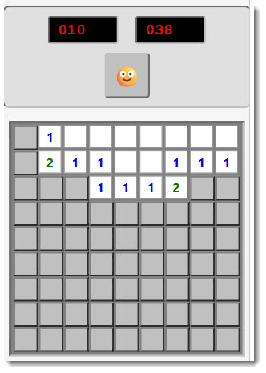

# Minesweeper

A fully functional Minesweeper game with customisable difficulty levels, a timer, and visual themes -- all running inside a Power BI custom visual.



## What It Does

Classic Minesweeper. Left-click to reveal a cell, right-click to flag it. Numbers tell you how many mines are adjacent. Reveal every safe cell to win. Hit a mine and it's over.

## Difficulty Levels

| Level        | Grid   | Mines |
| ------------ | ------ | ----- |
| Beginner     | 9x9    | 10    |
| Intermediate | 16x16  | 40    |
| Expert       | 30x16  | 99    |

Select the difficulty from the formatting pane in Power BI.

## Controls

- **Left-click** -- reveal a cell
- **Right-click** -- cycle through: flag, question mark, normal
- **Smiley button** -- restart the game

## Features

- First-click safety -- your first click is guaranteed to be safe
- Auto-reveal of empty areas (flood fill when you click a cell with no neighbouring mines)
- Mine counter showing how many flags remain
- Game timer
- Win and lose detection with visual feedback
- Three-state flagging: normal, flagged, question mark

## Formatting Options

| Category    | Properties                                                            |
| ----------- | --------------------------------------------------------------------- |
| Game        | Difficulty level, show/hide timer, show/hide mine counter             |
| Appearance  | Cell size (15-50px), border colour, cell colour, revealed cell colour, mine colour, flag colour |

All settings are available in the Power BI formatting pane and apply immediately without restarting the game.

## Data Roles

| Field    | Type     | Description                       |
| -------- | -------- | --------------------------------- |
| Category | Grouping | Category values for data binding  |
| Measure  | Measure  | Numeric values for data binding   |

The game runs independently of bound data.

## How to Run

```
cd minesweeper
npm install
pbiviz start
```

Open Power BI and add the Developer Visual to a report page.

## Strategy Tips

- Start with corners and edges -- statistically safer opening moves.
- Use the numbers to deduce mine locations logically before guessing.
- Flag confidently. If a number already has all its mines flagged, clicking it reveals the remaining neighbours automatically.
