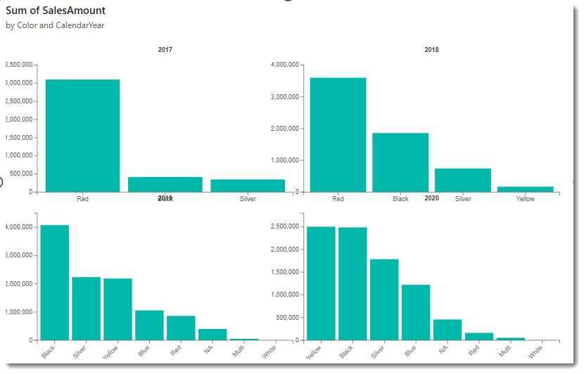

# Multi-Facet Column Chart

A D3-based column chart that splits data into facets, displaying a separate bar chart for each category in a grid layout.



## What It Does

The visual takes a category, a facet field, and a measure. It creates a small column chart for each distinct facet value and arranges them in a grid. This lets you compare the same measure across different slices of your data side by side.

## Data Roles

| Field    | Type     | Description                                |
| -------- | -------- | ------------------------------------------ |
| Category | Grouping | X-axis labels within each facet            |
| Facet    | Grouping | Creates a separate chart per unique value  |
| Measure  | Measure  | Bar height values                          |

## Features

- Grid layout with configurable maximum facets per row
- Independent column charts per facet, each with its own axes
- Facet title above each chart (customisable font, colour, weight)
- X and Y axis controls: show/hide, font size, colour, label rotation
- Tooltips on hover showing category and value
- Animation transitions when data changes
- Hover opacity effect on bars
- Configurable bar padding and chart margins

## Formatting Options

| Category     | Properties                                                     |
| ------------ | -------------------------------------------------------------- |
| Layout       | Bar padding, margins (top/bottom/left/right), facet padding, max facets per row |
| Axes         | Show/hide X and Y axes, font size, colour, rotate X labels, Y axis tick count |
| Facet Titles | Show/hide, font size, colour, font weight                      |
| General      | Show tooltips, animation duration, hover opacity               |
| Data Points  | Colours, fill rules                                            |

## How to Run

```
cd multiFacetColumnChart
npm install
pbiviz start
```

Open Power BI and add the Developer Visual to a report page. Drop a category field, a facet field, and a measure onto the visual.
