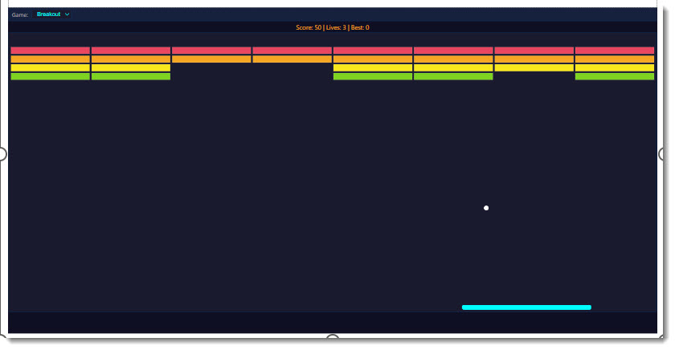

# Retro Arcade

Five retro-styled arcade games in one Power BI custom visual: Snake, Tetris, Space Shooter, Neon Drift, and Synth Labyrinth. Includes CRT scan line effects and a boss key that shows a fake spreadsheet.



## What It Does

A dropdown in the toolbar lets you select a game. Each game runs on a canvas with retro styling -- scan lines, glow effects, and pixel aesthetics. If someone walks past your desk, hit the boss key to instantly switch to a convincing fake spreadsheet view.

## The Games

| Game             | Description                                                        |
| ---------------- | ------------------------------------------------------------------ |
| Snake            | Classic snake game. Eat food, grow longer, don't hit yourself.     |
| Tetris           | Falling blocks. Complete rows to clear them.                       |
| Space Shooter    | Vertical scrolling shooter with enemy waves and projectiles.       |
| Neon Drift       | Driving game with a neon aesthetic.                                |
| Synth Labyrinth  | Navigate a maze with synthesiser-inspired visuals.                 |

## Features

- Modular game registry with standard lifecycle (init, start, stop, destroy, resize)
- CRT scan line overlay for retro authenticity
- Boss key -- instantly swap to a fake spreadsheet if needed
- Toolbar with game selector dropdown
- Canvas-based rendering for all games
- Responsive sizing when the visual is resized

## Data Roles

| Field    | Type     | Description                       |
| -------- | -------- | --------------------------------- |
| Category | Grouping | Category values for data binding  |
| Measure  | Measure  | Numeric values for data binding   |

The games run independently of bound data.

## How to Run

```
cd retroArcade
npm install
pbiviz start
```

Open Power BI and add the Developer Visual to a report page. Use the dropdown to select a game and click the visual to give it keyboard focus.
