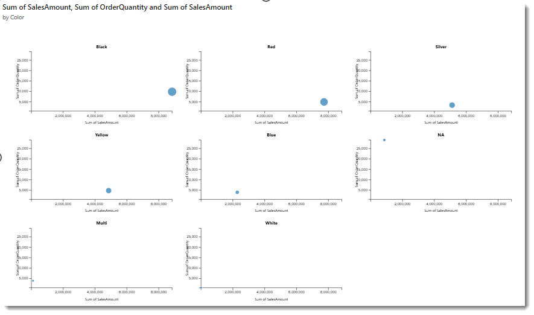

# Scatter Plot Small Multiples

A scatter plot chart with a small multiples layout, displaying multiple scatter plots in a grid for comparing categories side by side.



## What It Does

The visual creates a separate scatter plot for each unique value in the Category field and arranges them in a grid. This makes it straightforward to compare patterns across different groups using the same X and Y scales.

## Data Roles

| Field    | Type     | Description                                  |
| -------- | -------- | -------------------------------------------- |
| X-Axis   | Measure  | Horizontal position of each point            |
| Y-Axis   | Measure  | Vertical position of each point              |
| Category | Grouping | Creates a separate scatter plot per value     |
| Size     | Measure  | Bubble size (optional)                       |
| Legend   | Grouping | Colour grouping within each plot (optional)  |

## Features

- D3.js scatter plot rendering with automatic grid layout
- Grid dimensions calculated from the number of categories (square packing)
- Consistent scales across all plots for fair comparison
- Bubble sizing when a Size measure is provided
- Legend-based colour grouping within each plot
- Axis labels on each subplot
- Responsive cell sizing with configurable margins and padding
- Error handling with user-friendly messages when data is missing or misconfigured

## Formatting Options

| Property        | Description                            |
| --------------- | -------------------------------------- |
| Default Colour  | Base colour for data points            |
| Show All Points | Toggle full data point display         |

## How to Run

```
cd scatterPlotSmallMultiples
npm install
pbiviz start
```

Open Power BI and add the Developer Visual to a report page. Drop measures onto X-Axis and Y-Axis, and a category field to create the small multiples grid.
